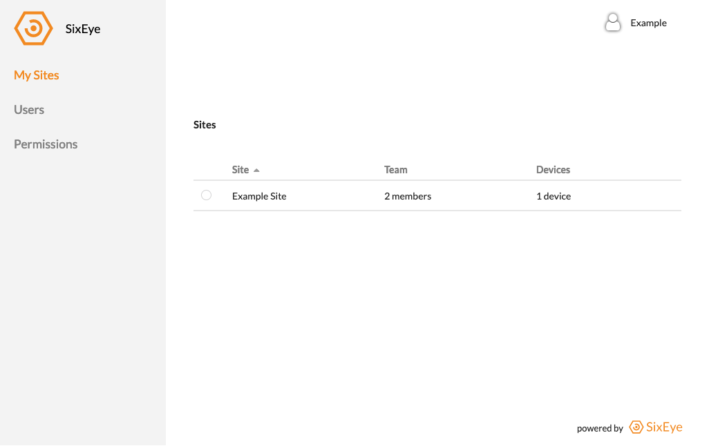

Basics
******

This section will cover some basic aspects 

User Interface
++++++++++++++

The User Interface in a SixEye portal is designed to be minimalistic and simple to use.

On the left of the interface is the menu bar which is headed by the portals name and/or logo.

My Sites
========

Contains all of the Sites that you are a member of and have the appropriate permission to view. Clicking on a Site in the table will take you to that Site. Selecting the Site using the radio button to the left of the Site name will bring up any functions you can do to that Site.

Users
=====

Contains a list of all the users that you share a Site with and whome you have the correct permissions to view.

Permissions
===========

Contains the ability to change users permissions in a Site or Portal context. All users will be able to see the permissions of users whome they share a Site with and have the correct permissions to view. It is likely only certain users will be able to edit those permissions.

For more on permissions see the permissions_ section of this documentation.

.. _permissions: Permissions.html

Terminology
+++++++++++

Portal
======

The Portal is the core area where Sites are contained. A Portal can be branded to match the brand of that Portal provider.

Sites
=====

A Site is a collection of information, typically containing some devices, users and the assocaited permissions for those users to view and interact with the devices in that Site. There are typically multiple Sites in a Portal.

Device
======

A Device is a physical item that is SixEye Connected. This means that the manufacturer of that device has allowed the device to talk to the SixEye servers and send information and/or allow interactions from the device to SixEye.