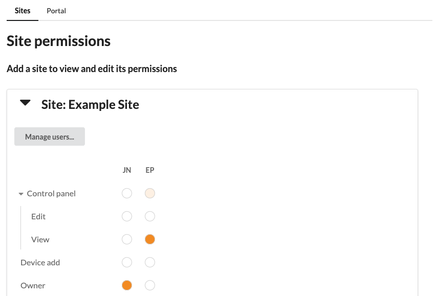

Permissions
***********

Permissions in SixEye allow for granular customisation of what a user can do per individual project/device or at a portal level per project/device. 

Permissions are listed vertically and the users within the current context are listed horizontally. 

The users listed depends on the context of the current permissions. In a Site only users in that site will be listed. Clicking ``Manage users...`` allows users to be managed. Clicking the users initals will also hide them from the grid.

A blank circle indicates the permission is non-granted where a filled in circle means that user has that permission. A partially filled circle indiactes that that parent permission contains a mix of granted and non-granted permissions. Currently parent permissions are only to indicate the status of child permissions and cannot be used to change the permissions within.

Contexts
--------

Context Site
++++++++++++

Permissions in this context are related to the current Site only. Users already in the site can be managed. Any user added to a Site but not yet registered will be preceded with an ``@``. 

All devices within a Site are managed on an individual basis.

Context Portal
++++++++++++++

Permissions in this context are related all Sites in the current Portal. Users already in the portal can be managed. Only users that the current users shares Sites with will appear here.

Devices are managed across the whole Portal. 

Some User settings are also available here. 

Note: Only SixEye Admins can adjust the ``Set Permissions`` permissions in this context.

Permissions functions
---------------------

In each section each permission has its own function. Not shown here are the ``Set Permissions`` sections. These are for setting who can set other users permissions whose functionality is explained in the following.

Context Site
------------

Site
++++

======================    ========  
Permission                Function
======================    ======== 
``Control panel:Edit``    Placeholder
``Control panel:View``    Placeholder
``Device add``            Can add a device to the current Site  
``Owner``                 Is granted all view permissions and ``Set Permissions`` permissions in the current site. There *must* be at least one owner per Site
``Site:Delete``           Can delete the current Site
``Site:Edit all``         Can edit all attributes for the current Site
``Site:View all``         Can view the current Site
``Task:Add``              Placeholder
``Task:Delete``           Placeholder
``Task:Edit``             Placeholder
``Task:Execute``          Placeholder
``Task:View``             Placeholder
``User:Add``              Can add users to the current Site
``User:Delete``           Can delete users from the current Site
``User:View``             Can view all users in the current Site
======================    ========

Device
++++++

===================   ========  
Permission            Function
===================   ======== 
``Action reset``      Can reset the current device
``Control``           Can control the device - typically this means adjusting the output
``File:Add``          Can add a file to the current devices SixEye file server
``File:Delete``       Can delete a file from the current devices SixEye file server
``File:Transfer``     Can tranfer a file from the SixEye file server to the current device
``File:View``         Can view all files on the current devices SixEye file server
``Information``       Can view information about the current device
``Maintenance``       Can view and adjust maintenance related information
``Device:Delete``     Can delete the current device
``Device:Replace``    Can replace the current device
``Device:View all``   Can view core information about the current device
``Setting beacon``    Can beacon the current device
===================   ========

Context Portal
--------------

Site
++++

=================   ========  
Permission          Function
=================   ======== 
``Self:Add``        Can add a Site in the current Portal
=================   ========

User
++++

==================   ========  
Permission           Function
==================   ======== 
``Self:Add``         Can add a User to the current Portal
``Self:Delete``      Can delete a User in the current Portal
``Self:Edit all``    Can edit all attributes related to Users in the current Portal
``Self:Suspend``     Can suspent any User in the current Portal
``Self:View all``    Can view all Users in the current Portal
==================   ========
