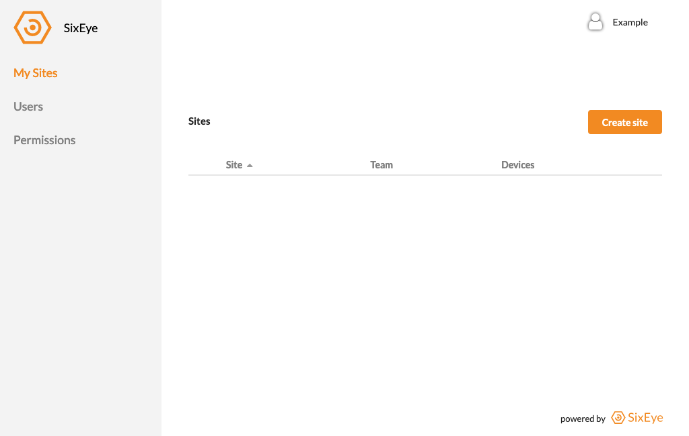
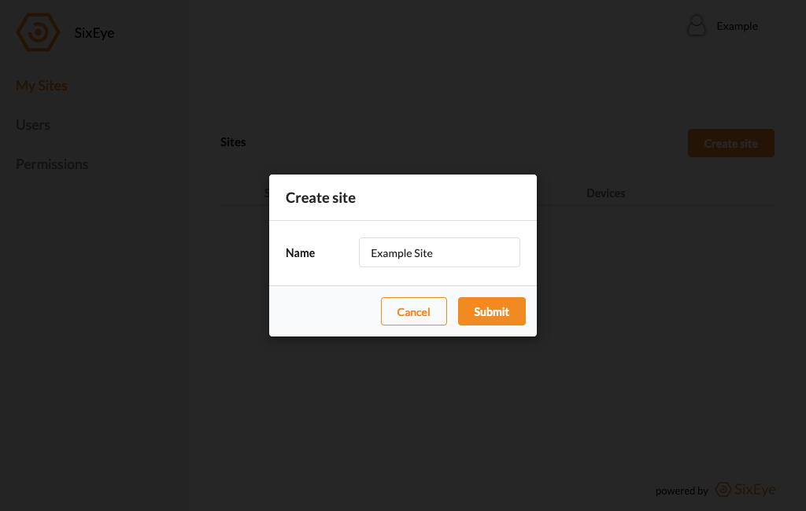
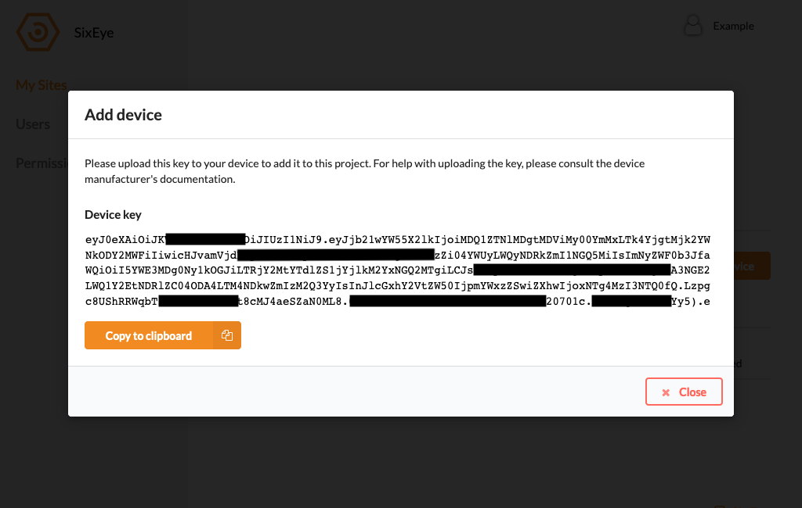
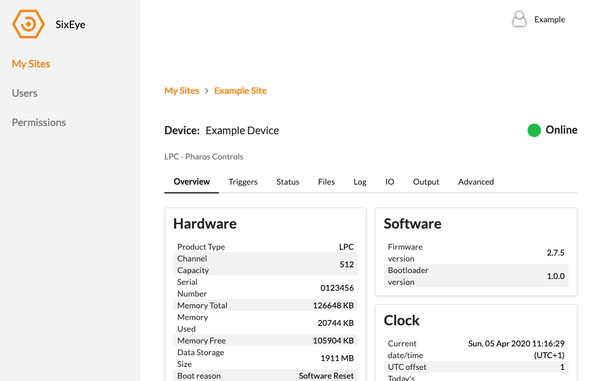
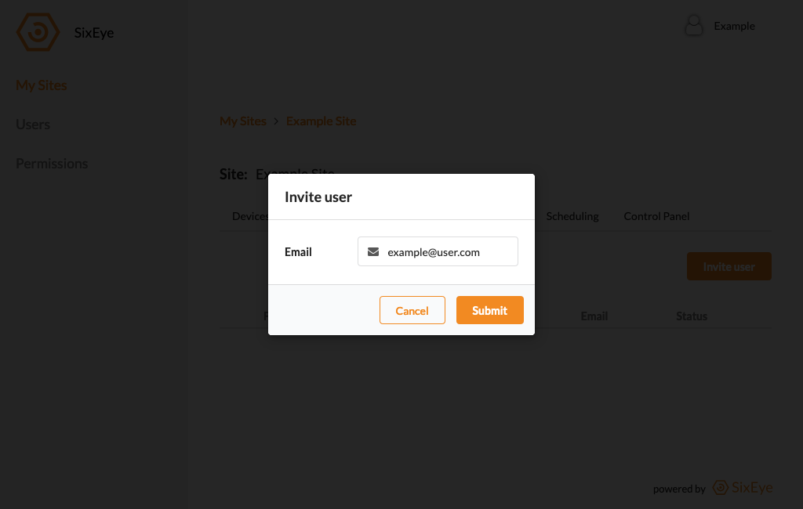
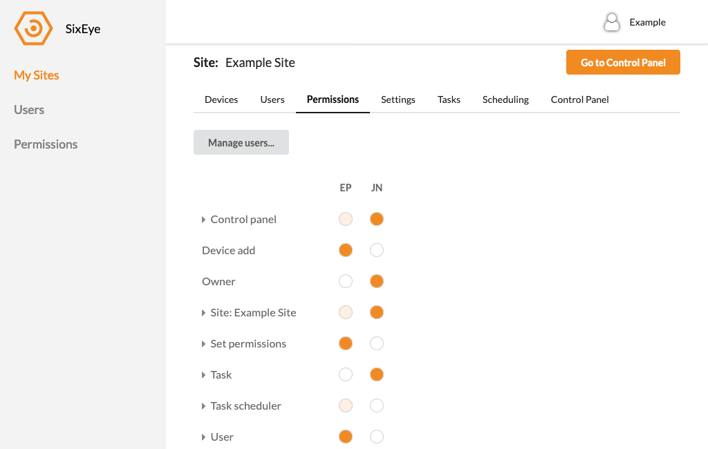

Quick Start
***********

The guide assumes you're a user with a full set of Permissions to be able to complete standard tasks in a SixEye portal. See more about Permissions_.

When you first log in to your Portal you will start in the 'My Sites' tab, which will contain a blank page.

Add a new site by clicking the 'Add Site' button in the top right and giving the Site a new name.

Next, add a device into the Site by clicking the 'Add Device' button in the 'Device' tab of the Site. Once you give the device a name a key will be generated that will need to be provided to the device. See the device manufacturers guidance on this.

Once the device has connected you will be able to select it and see move information about the device. Each device will provide different information and configuration options dependant on its purpose and what the device manufacturer has decided to support through SixEye.

To invite other users to the Site, navigate to the 'Users' tab and click the 'Add User' button. Input the users' email address to invite them to the project and they will receive an email with a signup link to fill out their profile.

A new user will be granted some basic view permissions to enable them to view certain aspects of a Site. Be sure to set some custom permissions for each new user in the 'Permissions' tab in a Site.

.. _permissions: Permissions.html