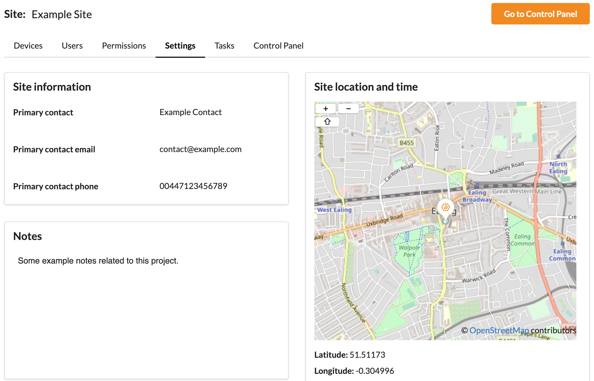
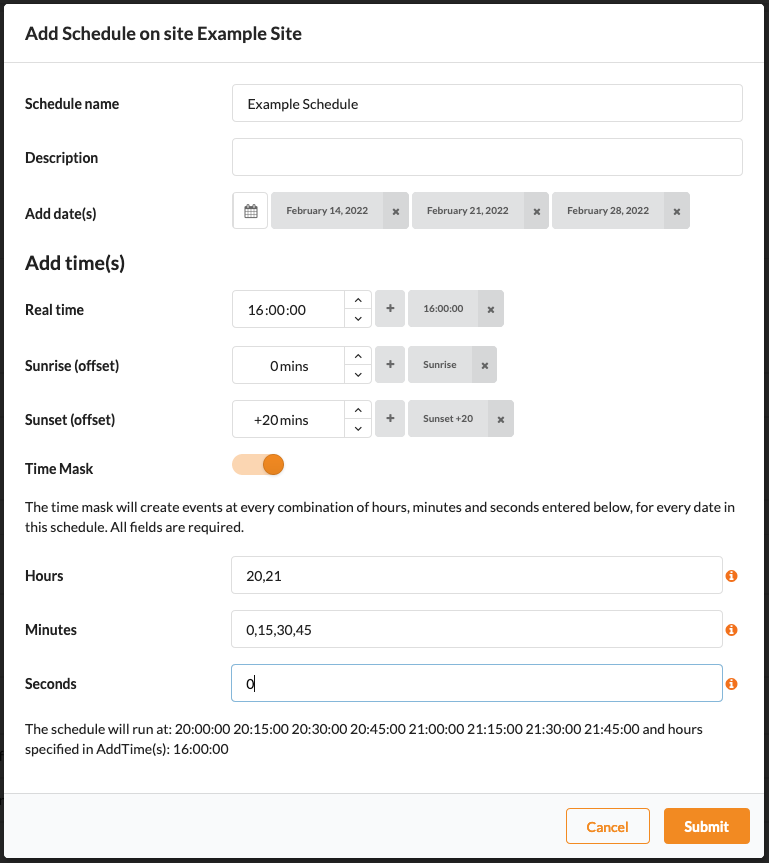

Sites
*****

A :term:`site` is a collection of information, typically containing some devices, users and the associated permissions for those users to view and interact with the devices in that :term:`site`. There are typically multiple Sites in a :term:`portal`.

Devices
=======

Devices in the :term:`site` that the current user has the correct Permissions to view are listed in a sortable table. The device name is custom whereas the other information about a given device is reported back from the device itself. 

More information about devices can be viewed by clicking it which will open the device view for that device. It is the decision of the device manufacturers as to what information the device reports back. 

Adding a device
---------------

- Click the `Add Device` button to the top right of the device table
- Give the device a name and click Submit
- Copy the :term:`device key` to the new device and paste it into the device using the method specified by the device manufacturer

A device will show as 'Unassociated' until the device connects for the first time. Permissions related to this device can be managed as soon as the device appears in the device table.

Replacing a device
------------------

- Select a device by clicking the circle to the left of the device name
- Select 'Replace' from the toolbar above the devices table
- Copy the new device key to the new device and paste it into the device using the method specified by the device manufacturer

Removing a device
-----------------

- Select a device by clicking the circle to the left of the device name
- Select 'Remove' from the toolbar above the devices table
- The device will be removed from the :term:`site` and the device will no longer try to connect to the :term:`site`

The Device name will be retained but when the new device connects all existing device information will be lost and replaced by the new device information

Note: where possible, all settings related to this device will be retained but if the device type has changed, Tasks and Actions associated with this device may be invalid. Please check the Tasks tab for any conflicts. 

Users
=====

Users that are part of a :term:`site` and that the current user has permission to view will appear here.

Users in a :term:`site` can be in 3 different states:

- Active: Can access the :term:`site` according to their permissions
- Invited: Is yet to create their account in this :term:`portal`, but when complete they will be able to access the account according to their permissions
- Suspended: This user has been suspended at a :term:`portal` level and will not be able to login or interact with the :term:`site`. Learn more about suspending a user :ref:`here<Suspending a user>`.

Inviting a user
---------------

- Click the 'Invite User' button to the top right of the users table
- Enter the new users' Email Address and click 'Submit'
- If the user is already part of the :term:`portal` then they'll be added to the :term:`site` and notified by email and an alert in their browser. If the user is new to the :term:`portal` they will receive an email asking them to make an account

New user email links are valid for 7 days after they are invited. If the user doesn't sign up in this time their link will become invalid and will need to be re-invited to the project by selecting the users and clicking 'Re-Invite' in the toolbar.

Removing a user
---------------

- Select a user by clicking the circle to the left of the users' name
- Click 'Remove' in the toolbar
- Confirm the removal of the user by entering their email address 

A user that has been removed from a :term:`site` will no longer be able to see the :term:`site` in their 'My Sites' section of the :term:`portal`. The user may still log in to the :term:`portal` even if they are not members of any :term:`site`. To stop a user logging in see :ref:`user suspension<Suspending a user>`.

Permissions
===========

User permissions for this :term:`site` alone can be managed here. For more on permissions see the permissions_ section of this documentation.

.. _permissions: Permissions.html

Settings
========

Site information
----------------

With the correct permissions, this information can be in-line edited. Click on the text to be edited to open up the text editor.

- Primary Contact: The name of the contact for this :term:`site`
- Primary Contact Email: The email address of the contact for this :term:`site`
- Primary Contact Phone: The phone number of the contact for this :term:`site`

While any information can be entered into the fields above we recommend using accurate contact information.

Notes
-----

A free form notes field for this :term:`site`. With the correct permissions, this can be in-line edited. Click on the text to be edited to open up the text editor.

Site location and time
----------------------

Selecting a :term:`site` location is important as this setting is used to determine the :term:`site`'s local time for scheduled tasks. 

In a new project, the map will display the SixEye office location to start with though the location is only set once a user has selected the :term:`site`'s actual location.

- Navigate around the map until you can see where the location of the :term:`site` is
- Click on the map where the location of the :term:`site` is
- If the pin looks to be correct and the address preview looks accurate click the checkmark to accept that location

One a location is set the following information will be filled:

- Latitude: the latitude of the :term:`site` 
- Longitude: the longitude of the :term:`site`
- Geo address: an address for the :term:`site` from the lat and long above. This address doesn't need to be exactly accurate for the :term:`site` to function correctly but should be as accurate as possible. This address is calculated on the SixEye servers
- UTC offset: the calculated UTC offset of the :term:`site` from the lat long
- Time zone: the calculated time zone of the :term:`site` from the lat long

Notifications
-------------

Three types of notification are currently available; connection, error, and warning. Users can choose which notifications to receive across a :term:`site` on a per device basis, or, using the context :term:`site` notification all devices within the current :term:`site`. 

**Connection**

Will send a notification when the selected device changes its online status. These notifications have some tolerance to allow for brief connection outages to devices. 

**Warning**

Will send a notification when the selected device produces a warning notification. These notifications are decided by the device manufacturer and may require configuration on the device to enable them. 

**Error**

Will send a notification when the selected device produces an error notification. These notifications are decided by the device manufacturer and may require configuration on the device to enable them. 

Tasks
=====

Click the `Add Task` button at the top right to add a new Task and give it a Name (required) and an optional Description. 

For anything to happen when a Task is run it needs at least one Action. To add Actions expand the Task in the table and click to `Add Action`. 

The Add Action form will dynamically update depending on what Actions the device manufacturer has decided the device should publish. Select the Device from the drop-down and then choose the Action type desired. Once the Action Type is selected the form will update with the parameters required for that Action. Action Name will always be required.

Actions can be deleted by clicking the `X` button in the action row and all Actions are editable inline. To edit, expand the action to view its `Parameter` and `Value` fields and click the `Value` that is to be edited. Edits are committed when the tick button is clicked, clicking anywhere else will cancel the edit.

Tasks and Actions can be renamed by either editing text inline by clicking within the dashed box around a name or, for Tasks, select the Task using the circle on the left of the table and choose ‘Edit’ in the menu above. This also applies to descriptions where applicable. 

Tasks can be run by selecting them and chose `Run` from the menu bar above the Task table. Deleting Tasks can also be achieved in the same way. All Actions in deleted Tasks will be lost.

As well as from within the Tasks tab, Tasks can be run by :ref:`Task Schedulers<Scheduling>`. and :ref:`Control Panel<Control Panel>`.

Scheduling
==========

To use Scheduling the Sites location must first be set. This can be done in the Sites :ref:`Settings Tab<Settings>`. All times listed are related to the Sites local time. A note will appear if your browser time and :term:`site` time do not match.

Scheduling consists of two items, Task Schedulers, and Schedulers. Task Schedulers contain the Tasks that are to be run and then one or multiple Schedulers that determine when the Tasks will be run. 

Task Schedulers
---------------

Click the `Add Task Scheduler` button at the top right of the table to add a new Task Scheduler. 

Choose a name, description, occurrence colour and initial Tasks to run. All of this can be edited later. Multiple Tasks can be added and tasks can be removed by clicking the `x` in the Tasks container. 

Schedules
---------

Expand out a Task Scheduler and click the `Add Schedule` button to add a Schedule which will define when a Task Scheduler will run. Multiple Schedules can be added to each Task Scheduler.

Choose a name, description, and dates for when the Schedule is to run. Multiple dates can be added and later removed by clicking the `x` in the Dates container. 

There are a few options to add times to a Schedule:

**Real Time**

Choose specific, non-changing times for when the Schedule should activate. 

**Sunrise**

Choose to activate the Schedule at Sunrise events local to the :term:`site` as specified in the location settings. Use the offset box to add an offset of +/-12 hours.

**Sunset**

Choose to activate the Schedule at Sunset events local to the :term:`site` as specified in the location settings. Use the offset box to add an offset of +/-12 hours.

**Time Mask**

Enabling the time mask will create events at every combination of hours, minutes and seconds entered, for every date in this schedule. All fields are required.

A preview of all the occurrence times will be generated for confirmation. 

Events Calendar
---------------

The Events Calendar gives a preview of what occurrences have run or will run on a specified day. Times and Task Scheduler will be shown for upcoming occurrences, with status for if occurrences was successfully run or not for past occurrences. 

Control Panel
=============

Add a page to the Sites Control Panel. Each page contains a name, 8 customisable buttons and background image. Pages can be renamed by editing text inline by clicking within the dashed box around the name. Click the `Upload background image` button to apply a new image to the background of the page. No image compression is done here so we recommend using sensibly sized images. Pages can be removed by deleting them at the bottom right. 

Each button can be enabled, have custom text, colours and an associated Task - to edit a button Click the existing button or its placeholder denoted with a `+` and a dashed line. The Control Panel editor view will give a preview of what the Control Panel will look like to users of the Control Panel but with the addition of the Task name appearing in the button.

Click the `Go to Control Panel` button at the top right of any :term:`site` view to be taken to the unique URL for the Control Panel. The URL that is loaded can be shared to other users who will be directed straight to the Control Panel after logging in with a user account with the correct Permissions.